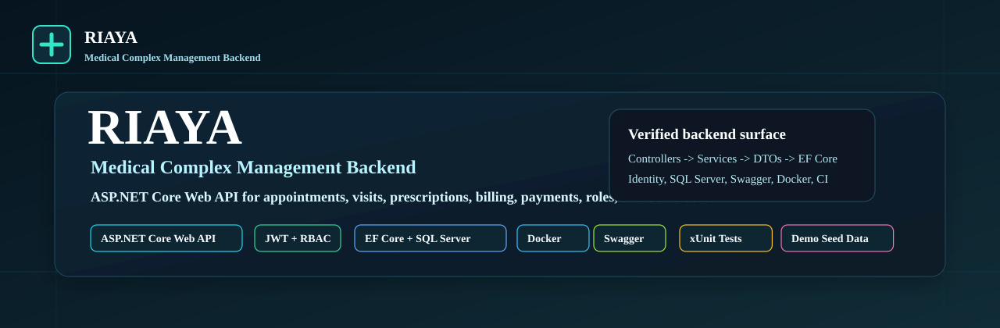

# RIAYA - Medical Complex Management Backend

RIAYA is a portfolio-grade ASP.NET Core Web API for managing medical complex operations: doctors, patients, appointments, visits, prescriptions, departments, clinic rooms, doctor-room assignments, billing, payments, dashboard data, and fictional local demo seed data.

It is built as a focused backend repository with production-oriented patterns for authentication, role-based authorization, EF Core persistence, Swagger/OpenAPI documentation, Dockerized local execution, and automated regression tests.

## Quick Facts

- ASP.NET Core Web API targeting .NET 10
- Entity Framework Core with SQL Server
- ASP.NET Core Identity
- JWT access tokens and refresh tokens
- Role-based access control for Admin, Doctor, and Receptionist
- Swagger / OpenAPI
- Dockerfile and Docker Compose
- xUnit tests
- GitHub Actions CI
- Serilog request/logging pipeline
- Fictional, idempotent local demo seed data

## Screenshots

The screenshots below are real Swagger screenshots from RIAYA. They do not show bearer tokens, refresh tokens, production secrets, real patient data, or local machine paths.

### Swagger Overview

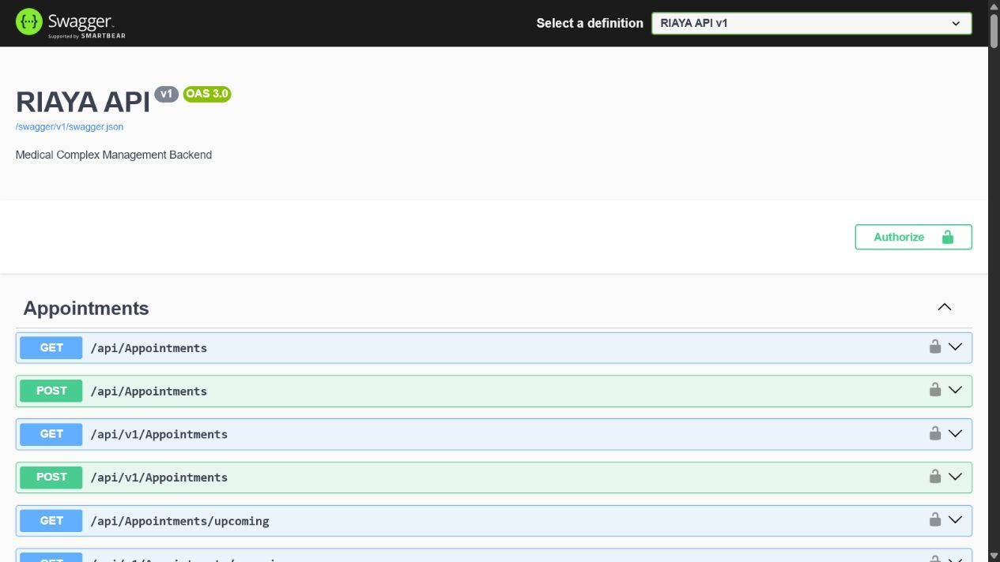

### Appointments Workflow


### Medical Complex Structure

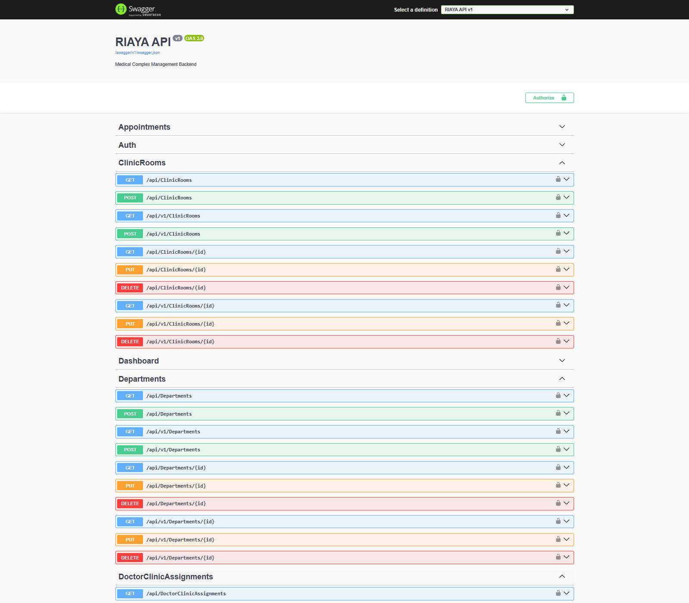

### Billing & Payments


### Authentication Endpoints

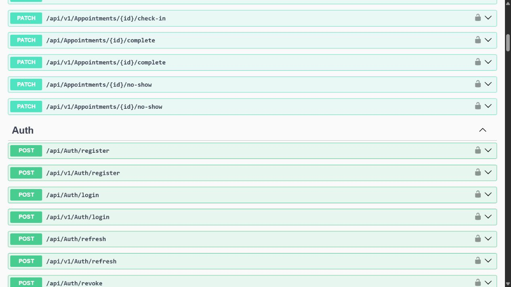

### Dashboard Endpoint

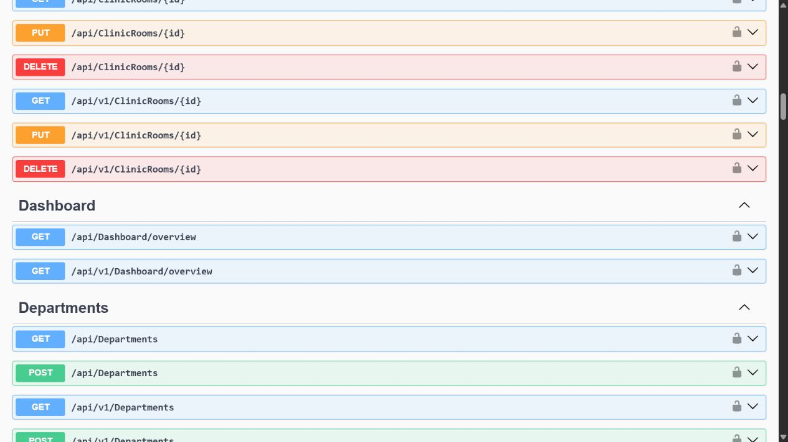

## Project Overview

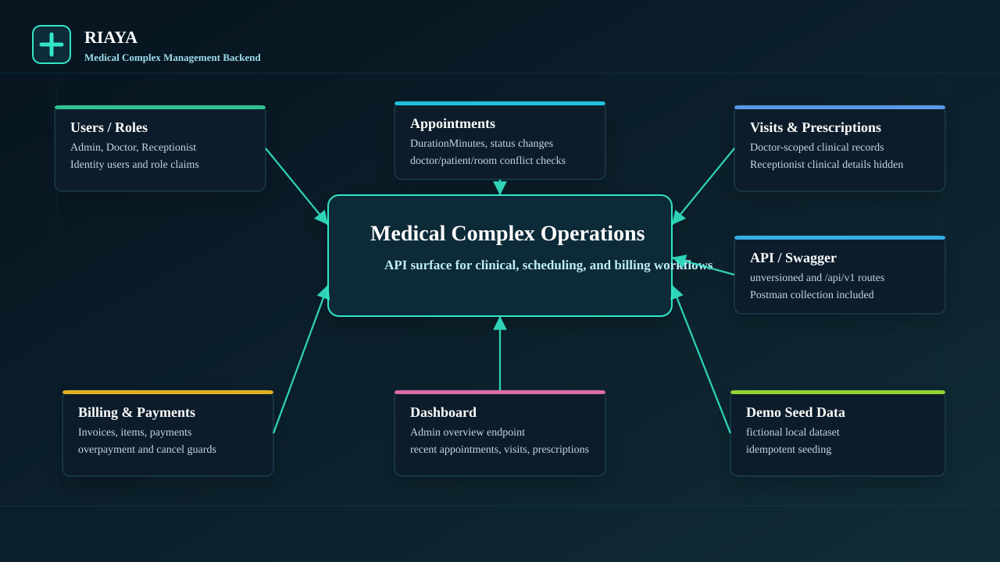

RIAYA models the backend side of a medical complex. It is not just a CRUD sample: appointments reserve doctor, patient, and clinic-room time; visits and prescriptions are scoped to clinical roles; receptionists are blocked from clinical detail leaks; and billing rules protect invoice and payment integrity.

The project exists as a backend portfolio system that demonstrates realistic API boundaries, role separation, workflow rules, database persistence, demo data, documentation, and tests in one repository.

## Core Modules

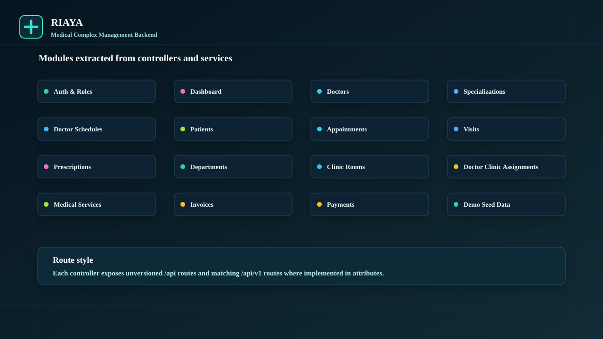

Modules verified from controllers and services:

- Authentication & Roles
- Dashboard
- Doctors & Specializations
- Doctor Schedules
- Patients
- Appointments
- Visits
- Prescriptions
- Departments
- Clinic Rooms
- Doctor Clinic Assignments
- Medical Services
- Invoices
- Payments
- Demo Seed Data

## Architecture

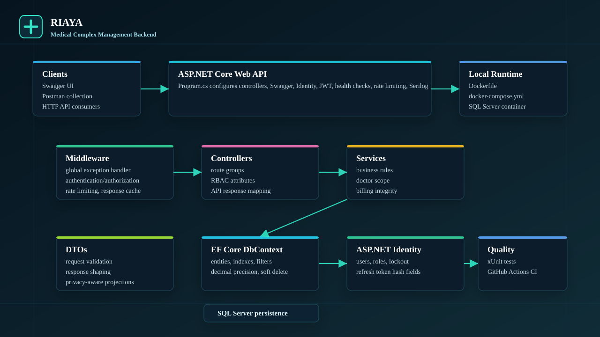

RIAYA is a single ASP.NET Core Web API project plus an xUnit test project:

- `Riaya.Api` contains controllers, services, DTOs, entities, EF Core `AppDbContext`, seeders, middleware, and application extensions.
- `Riaya.Tests` contains service tests, integration tests, API smoke tests, authorization metadata tests, privacy tests, billing tests, and demo seed tests.
- Controllers expose unversioned `/api/...` routes and versioned `/api/v1/...` routes.
- Services hold the business workflow rules.
- DTOs shape request and response contracts.
- EF Core persists Identity and domain entities to SQL Server.
- Middleware and extensions configure exception handling, validation responses, Swagger, JWT authentication, authorization policies, rate limiting, response caching, health checks, and Serilog.

## Business Workflows

### Appointment Workflow

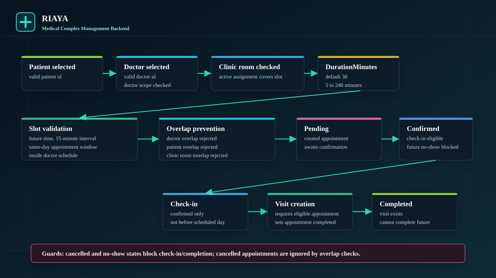

Appointments store `DurationMinutes` and validate the selected doctor, patient, optional clinic room, doctor schedule, and active doctor-room assignment. Overlap checks reject conflicts for the doctor, patient, and clinic room. Appointment states include `Pending`, `Confirmed`, `CheckedIn`, `Completed`, `Cancelled`, and `NoShow`.

Check-in is allowed only for confirmed appointments on or after the scheduled day. Visit creation completes the linked appointment. Future appointments cannot be completed or marked no-show.

### Visit & Prescription Workflow

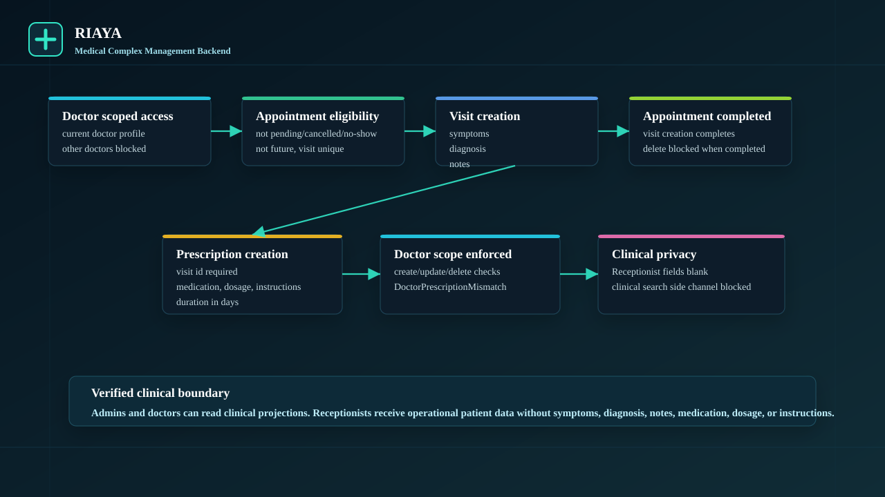

Visits require an eligible appointment and include symptoms, diagnosis, and notes. Prescriptions attach to visits and include medication name, dosage, instructions, and duration. Doctors are scoped to their linked doctor profile and cannot work with another doctor's visit or prescription.

Receptionists can use operational patient and appointment data, but clinical fields are omitted from receptionist-facing visit, prescription, and patient-history projections. Clinical search terms are also role-aware so result counts do not leak diagnosis, notes, medication, dosage, or instructions.

### Billing & Payments Workflow

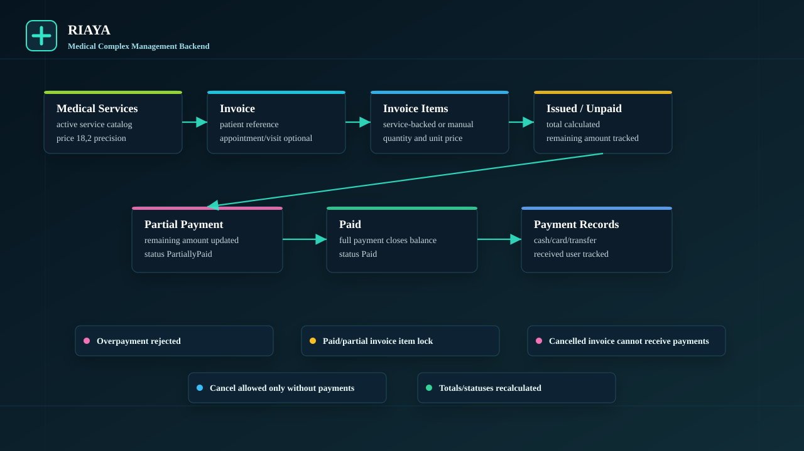

Invoices contain invoice items, optional medical-service references, totals, paid amounts, remaining amounts, and status transitions. Payments record amount, method, timestamp, receiver user id, and notes.

Billing rules verified in services and tests:

- Invoice items cannot be changed after payment has started.
- Paid and partially paid invoices are locked for item changes.
- Invoices with payments cannot be cancelled without a refund or reversal workflow.
- Cancelled invoices cannot receive payments.
- Overpayments are rejected.
- Totals, paid amounts, remaining amounts, and statuses are recalculated from invoice items and payments.

## Roles & Authorization

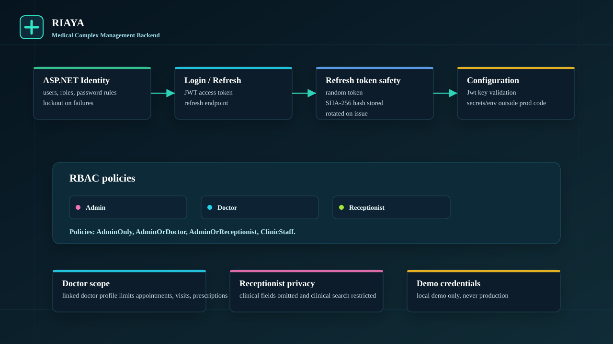

RIAYA defines three roles:

- `Admin`: administrative and clinical access, dashboard overview, management actions, and protected registration.
- `Doctor`: access scoped to the linked doctor profile for appointments, visits, prescriptions, and related patient data.
- `Receptionist`: operational access for patients, appointments, check-in/no-show workflows, invoices, payments, and non-clinical views.

Authorization policies verified in `AppPolicies` and application authorization setup:

- `AdminOnly`
- `AdminOrDoctor`
- `AdminOrReceptionist`
- `ClinicStaff`

## Security & Privacy

Security-related behavior verified from code:

- ASP.NET Core Identity stores users and roles.
- Login issues a JWT access token with role claims.
- Refresh tokens are generated server-side, hashed with SHA-256 before storage, and rotated when tokens are issued.
- JWT configuration is validated at startup, including minimum key length and non-development key rules.
- Role-based controller policies separate admin, doctor, and receptionist responsibilities.
- Doctor profile links enforce clinical scope.
- Receptionist clinical privacy restrictions apply to response projections and search behavior.
- Demo credentials are local-only and must not be used in production or shared deployments.

## Demo Seed Data

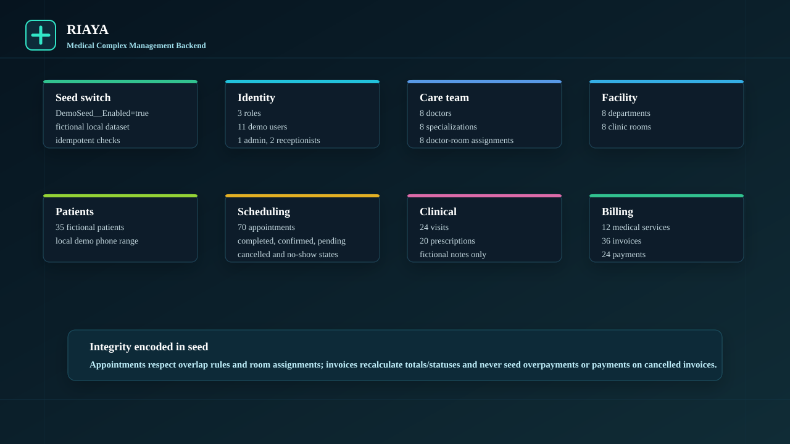

Demo seeding is controlled by:

```powershell
DemoSeed__Enabled=true
```

The demo dataset is fictional, idempotent, and intended for local portfolio demonstration only.

Verified seed counts:

- 3 roles: Admin, Doctor, Receptionist
- 11 demo users: 1 admin, 2 receptionists, 8 doctors
- 8 specializations
- 8 departments
- 8 clinic rooms
- 8 doctor clinic assignments
- 35 patients
- 70 appointments
- 24 visits
- 20 prescriptions
- 12 medical services
- 36 invoices
- 24 payments

## Technology Stack

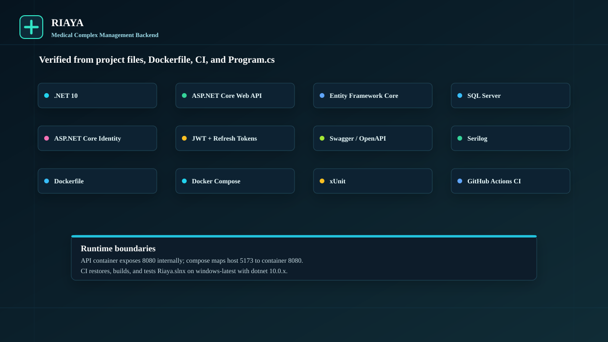

Verified from project files:

- .NET 10 target framework
- ASP.NET Core Web API
- Entity Framework Core
- SQL Server
- ASP.NET Core Identity
- JWT bearer authentication
- Swagger / OpenAPI via Swashbuckle
- Serilog with console and file sinks
- Docker and Docker Compose
- xUnit
- GitHub Actions CI on `windows-latest`
- Postman collection for local API exploration

## Testing & Quality

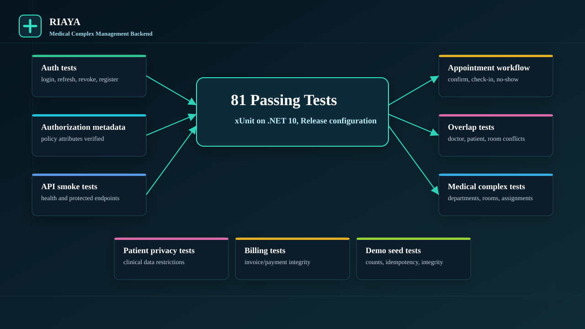

Test command:

```powershell
dotnet test .\Riaya.slnx --configuration Release --no-build --verbosity minimal
```

Last local validation in this documentation pass:

- Passed: 81
- Failed: 0
- Skipped: 0
- Total: 81

Coverage areas include auth, refresh/revoke behavior, authorization metadata, appointment workflow, overlap detection, check-in/no-show guards, visit and prescription scope, patient privacy, medical complex structure, billing/payment integrity, demo seed counts, demo seed idempotency, and API smoke behavior.

## API Overview

Both unversioned and versioned route prefixes are available:

- Auth: `/api/Auth`, `/api/v1/Auth`
- Dashboard: `/api/Dashboard/overview`, `/api/v1/Dashboard/overview`
- Doctors: `/api/Doctors`, `/api/v1/Doctors`
- Specializations: `/api/Specializations`, `/api/v1/Specializations`
- DoctorSchedules: `/api/DoctorSchedules`, `/api/v1/DoctorSchedules`
- Patients: `/api/Patients`, `/api/v1/Patients`
- Appointments: `/api/Appointments`, `/api/v1/Appointments`
- Visits: `/api/Visits`, `/api/v1/Visits`
- Prescriptions: `/api/Prescriptions`, `/api/v1/Prescriptions`
- Departments: `/api/Departments`, `/api/v1/Departments`
- ClinicRooms: `/api/ClinicRooms`, `/api/v1/ClinicRooms`
- DoctorClinicAssignments: `/api/DoctorClinicAssignments`, `/api/v1/DoctorClinicAssignments`
- MedicalServices: `/api/MedicalServices`, `/api/v1/MedicalServices`
- Invoices: `/api/Invoices`, `/api/v1/Invoices`
- Payments: `/api/Payments`, `/api/v1/Payments`

## Getting Started

```powershell
dotnet restore .\Riaya.slnx
dotnet build .\Riaya.slnx --configuration Release --no-restore
dotnet test .\Riaya.slnx --configuration Release --no-build --verbosity minimal
dotnet ef database update --project .\Riaya.Api\Riaya.Api.csproj --startup-project .\Riaya.Api\Riaya.Api.csproj
dotnet run --project .\Riaya.Api\Riaya.Api.csproj --launch-profile http
```

Local URLs:

- API: `http://localhost:5173`
- Swagger: `http://localhost:5173/swagger`
- Health: `http://localhost:5173/health`

Swagger is enabled in the `Development` environment.

## Docker

```powershell
copy .env.example .env
docker compose up --build
```

Docker files verified from source:

- API container: `riaya-api`
- SQL Server container: `riaya-sqlserver`
- API container port: `8080`
- Host API port from compose: `5173`
- SQL Server host port from compose: `14333`
- Compose database: `RiayaDb`

Docker runtime was not verified in this documentation pass because the Docker daemon was not running. The Docker commands above are documented from `Dockerfile`, `docker-compose.yml`, and `.env.example`.

## Demo Accounts

Local demo values are for portfolio demonstration only. Do not use them in production or shared deployments.

When `DemoSeed__Enabled=true`, the demo seed creates:

- `admin@riaya.local`
- `reception1@riaya.local`
- `reception2@riaya.local`
- `doctor1@riaya.local` through `doctor8@riaya.local`

The demo seed password in code is:

```text
Admin@12345
```

`.env.example` contains placeholder local values for Docker and admin seeding. Replace them for any real deployment.

## Database

EF Core migrations are stored under `Riaya.Api/Migrations`.

The current model includes:

- Identity users and roles
- Doctors, specializations, patients, appointments, doctor schedules
- Visits and prescriptions
- Departments, clinic rooms, doctor clinic assignments
- Medical services, invoices, invoice items, payments
- Audit fields and soft-delete fields on domain entities
- Query filters for soft-deleted records
- Decimal precision for medical service, invoice, invoice item, and payment amounts

Pending model check:

```powershell
dotnet ef migrations has-pending-model-changes --project .\Riaya.Api\Riaya.Api.csproj --startup-project .\Riaya.Api\Riaya.Api.csproj
```

Last local validation in this documentation pass reported no pending model changes.

## Postman

The local Postman collection is available at:

- [postman/RIAYA.postman_collection.json](postman/RIAYA.postman_collection.json)

The collection uses local variables and does not store real bearer tokens or refresh tokens.

## Documentation

- [Deployment guide](docs/deployment.md)
- [Screenshot notes](docs/screenshots.md)
- [Asset manifest](docs/assets/README.md)

## Repository Structure

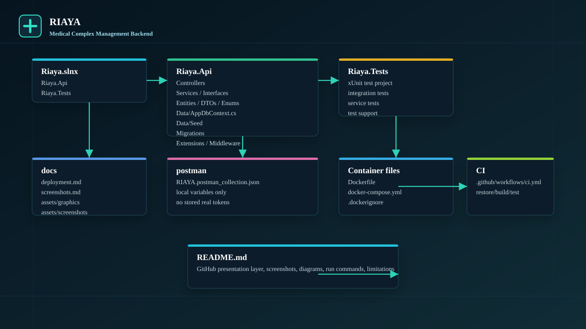

```text
RIAYA/
  Riaya.slnx
  Riaya.Api/
    Controllers/
    Services/
    Interfaces/
    Entities/
    DTOs/
    Data/
    Data/Seed/
    Migrations/
    Extensions/
    Middlewares/
  Riaya.Tests/
  docs/
    assets/
      graphics/
      screenshots/
  postman/
    RIAYA.postman_collection.json
  Dockerfile
  docker-compose.yml
  .github/workflows/ci.yml
```

## Roadmap

Current README roadmap items:

- AuthController refactor
- TimeProvider / UTC policy
- Reports Pro
- Daily Cash Closing
- Audit Log Pro
- Lab/Radiology requests
- Notification Center

## Limitations

- RIAYA is a portfolio-grade backend with production-oriented patterns, not a full production deployment package.
- There is no frontend application in this repository.
- There is no real payment gateway integration.
- Demo seed data is local-only and fictional.
- Docker runtime was not verified in this documentation pass because the Docker daemon was unavailable.
- No code coverage percentage is claimed because no coverage report is generated by the documented validation commands.
- No license file is included in the repository.
