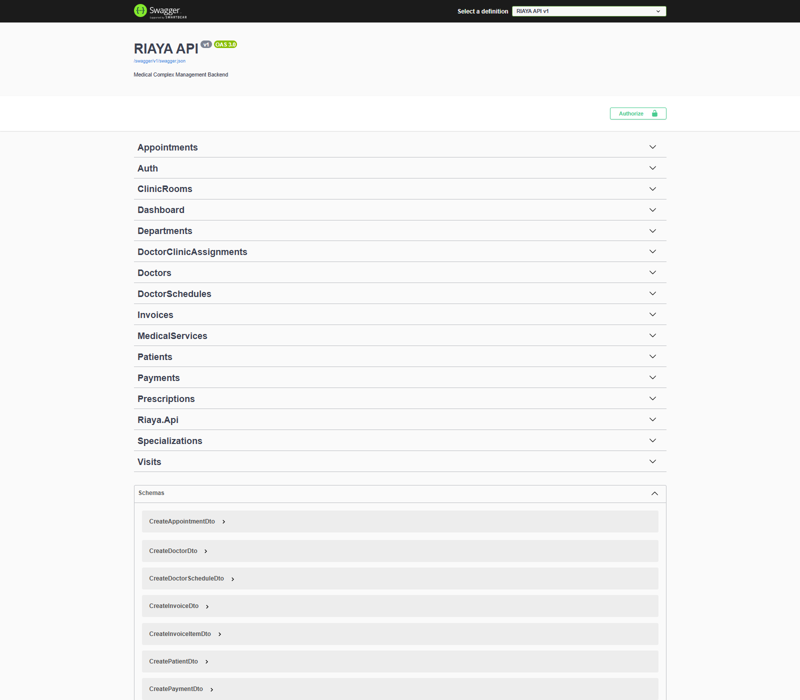
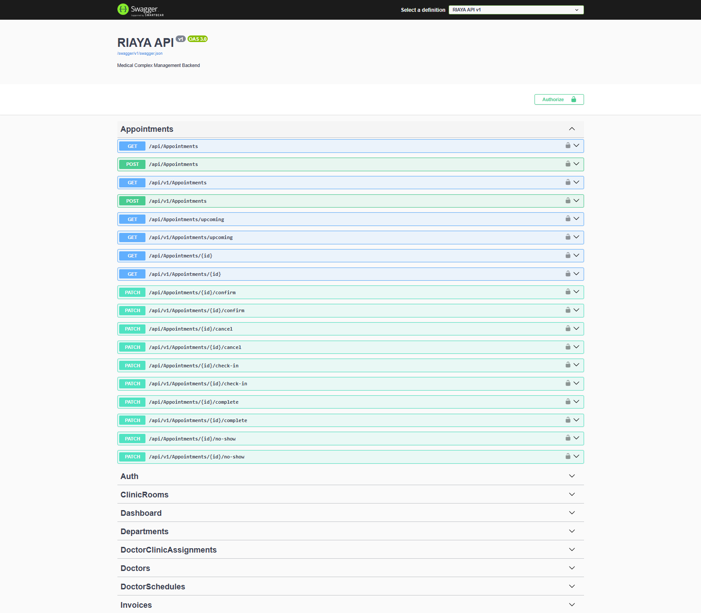
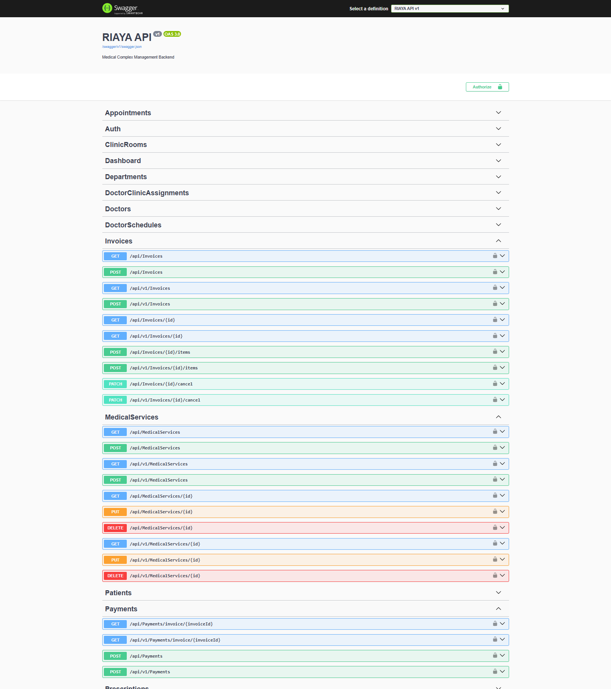

# RIAYA — Medical Complex Management Backend

Portfolio-grade ASP.NET Core Web API for managing medical complex operations including doctors, patients, appointments, visits, prescriptions, departments, clinic rooms, billing, payments, and demo data.

RIAYA is built as a focused backend portfolio project with production-oriented patterns for authentication, role-based authorization, EF Core persistence, Swagger documentation, Dockerized local execution, automated regression tests, and Flutter-ready API routing.

## Tech Stack

* ASP.NET Core Web API (.NET 10)
* Entity Framework Core
* SQL Server
* ASP.NET Core Identity
* JWT + refresh tokens
* Swagger / OpenAPI
* Docker and Docker Compose
* xUnit
* Serilog
* GitHub Actions CI

## Screenshots

The screenshots below were captured from the current local RIAYA API running at `http://localhost:5173/swagger`.

They do not contain bearer tokens, refresh tokens, production secrets, or real patient data.

### Swagger Overview



### Appointments Workflow



### Medical Complex Structure


### Billing & Payments



Test-result and Docker screenshots are intentionally not linked here because no real terminal or Docker-running screenshot was captured in this environment.

## Core Modules

* Authentication & roles
* Doctors
* Patients
* Appointments
* Visits
* Prescriptions
* Departments
* Clinic rooms
* Doctor clinic assignments
* Billing
* Invoices
* Payments
* Dashboard
* Demo seed data
* Swagger
* Docker
* Tests

## Roles

* `Admin`: manages the system and has full administrative and clinical access.
* `Doctor`: sees and manages medical data only inside the linked doctor profile scope.
* `Receptionist`: manages administrative and operational data such as patients, appointments, check-in, invoices, and payments.

Receptionists do not see clinical details such as diagnosis, notes, symptoms, prescription medication, dosage, or instructions.

Doctor profiles can only be linked to application users that already have the `Doctor` role.

## Business Rules

* Appointment duration is stored per appointment and defaults to 30 minutes.
* Doctor, patient, and clinic room appointment overlaps are rejected using appointment start time plus `DurationMinutes`.
* Cancelled appointments are ignored by overlap checks; other statuses still reserve the slot.
* Clinic room bookings require an active doctor-room assignment covering the full appointment duration.
* Check-in is allowed only for confirmed appointments.
* Check-in is blocked for pending, cancelled, completed, and no-show appointments.
* Future appointments cannot be marked as no-show.
* Creating a visit completes the linked appointment.
* Visits cannot be created for pending, cancelled, no-show, or future appointments.
* A doctor cannot create or modify visits or prescriptions for another doctor's appointment.
* Paid and partially paid invoices cannot have invoice items changed.
* Invoices with payments cannot be cancelled without a separate refund or reversal workflow.
* Cancelled invoices cannot receive payments.
* Overpayments are rejected.
* Invoice totals, paid amounts, remaining amounts, and status transitions are recalculated from invoice items and payments.
* Receptionist clinical search side channels are blocked for symptoms, diagnosis, notes, medication names, dosage, and prescription instructions.

## API Overview

Both unversioned and versioned route prefixes are available:

* Auth: `/api/auth`, `/api/v1/auth`
* Dashboard: `/api/dashboard/overview`, `/api/v1/dashboard/overview`
* Doctors: `/api/doctors`, `/api/v1/doctors`
* Specializations: `/api/specializations`, `/api/v1/specializations`
* Doctor schedules: `/api/doctorschedules`, `/api/v1/doctorschedules`
* Patients: `/api/patients`, `/api/v1/patients`
* Appointments: `/api/appointments`, `/api/v1/appointments`
* Visits: `/api/visits`, `/api/v1/visits`
* Prescriptions: `/api/prescriptions`, `/api/v1/prescriptions`
* Departments: `/api/departments`, `/api/v1/departments`
* Clinic rooms: `/api/clinicrooms`, `/api/v1/clinicrooms`
* Doctor clinic assignments: `/api/doctorclinicassignments`, `/api/v1/doctorclinicassignments`
* Medical services: `/api/medicalservices`, `/api/v1/medicalservices`
* Invoices: `/api/invoices`, `/api/v1/invoices`
* Payments: `/api/payments`, `/api/v1/payments`

Postman collection:

* [RIAYA.postman_collection.json](postman/RIAYA.postman_collection.json)

## Flutter Integration

For Android Emulator, Flutter should use:

```text
http://10.0.2.2:5173/api/v1/
```

For browser, desktop, Postman, or Swagger on the host machine, use:

```text
http://localhost:5173
```

Docker maps host port `5173` to the API container port `8080`:

```yaml
ports:
  - "5173:8080"
```

The API container listens internally on:

```text
http://+:8080
```

## How To Run Locally

Requirements:

* .NET 10 SDK
* SQL Server or SQL Server Docker container
* Docker Desktop, if using Docker Compose
* EF Core CLI tools, if running migrations manually

Restore, build, test, migrate, and run:

```powershell
dotnet restore ".\Riaya.slnx"
dotnet build ".\Riaya.slnx" --no-restore
dotnet test ".\Riaya.slnx"

dotnet ef database update `
  --project ".\Riaya.Api\Riaya.Api.csproj" `
  --startup-project ".\Riaya.Api\Riaya.Api.csproj"

dotnet run --project ".\Riaya.Api\Riaya.Api.csproj" --launch-profile http
```

Local URLs:

* API: `http://localhost:5173`
* Swagger: `http://localhost:5173/swagger`
* Health: `http://localhost:5173/health`

## Docker Run

Create a local `.env` file from `.env.example`:

```powershell
copy .env.example .env
```

Then run:

```powershell
docker compose down -v
docker compose up -d --build
docker ps
```

Docker uses:

* API container: `riaya-api`
* SQL Server container: `riaya-sqlserver`
* Database: `RiayaDb`
* Host API port: `5173`
* API container port: `8080`

## Environment Variables

`.env.example` contains local demo values only. Do not use those values for production or shared deployments.

Required local variables:

```env
SA_PASSWORD=ChangeMe_StrongPassword_2026!
JWT_KEY=ChangeMe_LongJwtSecretKey_AtLeast32Chars!
ADMIN_EMAIL=admin@riaya.local
ADMIN_PASSWORD=Admin@12345
ADMIN_FULL_NAME=RIAYA Admin
ADMIN_SEED_ENABLED=true
DEMO_SEED_ENABLED=true
```

Docker Compose maps these environment variables into ASP.NET Core configuration keys.

Expected ASP.NET Core configuration equivalents:

```text
AdminSeed__Enabled=true
DemoSeed__Enabled=true
```

Do not commit a real `.env` file.

Only `.env.example` should be committed.

## Demo Accounts

Default local demo account values:

* `ADMIN_EMAIL=admin@riaya.local`
* `ADMIN_PASSWORD=Admin@12345`
* `ADMIN_FULL_NAME=RIAYA Admin`

When demo seed is enabled, the seed also creates local-only demo users:

* `admin@riaya.local`
* `reception1@riaya.local`
* `reception2@riaya.local`
* `doctor1@riaya.local` through `doctor8@riaya.local`

The shared local demo password is:

```text
Admin@12345
```

These accounts are for local portfolio demonstration only.

## Demo Seed Data

Demo seed data is enabled through local configuration:

```text
DemoSeed__Enabled=true
```

When using Docker Compose, this can be supplied through:

```env
DEMO_SEED_ENABLED=true
```

The dataset is fictional, idempotent, and intended for local demo use only. It is not production data and does not contain real patients, secrets, or payment integrations.

The current seed creates:

* 3 roles: Admin, Doctor, Receptionist
* 11 demo users: 1 admin, 2 receptionists, 8 doctors
* 8 specializations
* 8 departments
* 8 clinic rooms
* 8 doctor clinic assignments
* 35 patients
* 70 appointments distributed across past dates, today, and upcoming dates
* 24 visits
* 20 prescriptions
* 12 medical services
* 36 invoices
* 24 payments

The seed respects appointment overlap rules, doctor-room assignments, completed-appointment visit links, invoice totals, partial/full payment status, no overpayments, and no payments on cancelled invoices.

## Database

Migrations are stored under:

```text
Riaya.Api/Migrations
```

Common EF commands:

```powershell
dotnet ef database update `
  --project ".\Riaya.Api\Riaya.Api.csproj" `
  --startup-project ".\Riaya.Api\Riaya.Api.csproj"

dotnet ef migrations has-pending-model-changes `
  --project ".\Riaya.Api\Riaya.Api.csproj" `
  --startup-project ".\Riaya.Api\Riaya.Api.csproj"
```

Local seed data is controlled by:

```text
AdminSeed__Enabled=true
DemoSeed__Enabled=true
```

Demo seed data is for local development and portfolio demonstration only.

## Tests

Run the regression suite:

```powershell
dotnet test ".\Riaya.slnx"
```

Current suite: 81 passing tests covering auth, authorization metadata, appointment workflow, duration-based overlap checks, check-in/no-show behavior, clinical privacy, medical complex structure, doctor-room assignment consistency, billing/payment integrity, demo seed counts, demo seed idempotency, demo seed appointment integrity, demo seed billing integrity, and API smoke coverage.

## Security Notes

* Refresh tokens are generated server-side, hashed before storage, and rotated.
* JWT settings must come from environment-specific configuration outside source control.
* Receptionist-facing patient, visit, and prescription responses intentionally omit clinical details.
* Clinical search is role-aware to avoid leaking diagnosis, notes, medication names, dosage, or instructions through result counts.
* Soft-deleted records are excluded from normal business validations.
* `.env.example` is local/demo-only documentation and not a production secrets file.
* `.env` must remain ignored by Git and must not be committed.
* Demo credentials must never be reused in production.

## GitHub Readiness Checklist

Before pushing:

```powershell
dotnet --version
dotnet restore ".\Riaya.slnx"
dotnet build ".\Riaya.slnx" --no-restore
dotnet test ".\Riaya.slnx"
docker compose down -v
docker compose up -d --build
docker ps
```

Then verify:

* Swagger opens at `http://localhost:5173/swagger`
* Health opens at `http://localhost:5173/health`
* No `.env` file is staged
* No real secrets are committed
* No `.NET 9` references remain
* Dockerfile uses `.NET 10` images
* All projects target `net10.0`
* GitHub Actions uses `10.0.x`, if CI exists

## Roadmap

* AuthController refactor
* TimeProvider / UTC policy
* Reports Pro
* Daily Cash Closing
* Audit Log Pro
* Lab/Radiology requests
* Notification Center
* Refund and reversal workflow for paid invoices
* Advanced appointment calendar views
* Doctor availability management
* Production deployment profile
